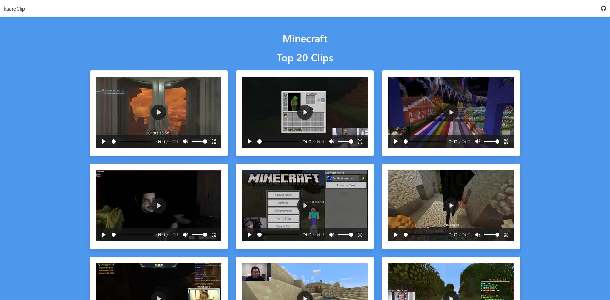

A-frame Storytelling - 11ty
=====

Storytelling experience built using A-frame and Anime.js.

Entities are picked from Wikidata, JSON upload or custom defination in Markdown files. 

=====

This example contains [11ty Javascript Data Files](https://www.11ty.dev/docs/data-js/) that take Twitch provided clip data. The front end utilizes [Bulma](https://bulma.io/) for layout and styling. When code is committed or content is published, a build process is triggered that utilizes [GitHub Actions for GitHub Pages](https://github.com/peaceiris/actions-gh-pages) to build and deploy the website.

Getting started
=====

#### Build the site

* On the command line, navigate to your cloned repo and install your dependencies with `npm install`.
* Run Eleventy with `npx eleventy --serve`. We're using the `--serve` argument so eleventy will host the site for us. Navigiate to [localhost:8080](http://localhost:8080) (or whatever port 11ty provides you if 8080 is already in use) to view the site.

#### Ref
* https://github.com/contentful/11ty-contentful-gallery
* https://github.com/karx/kaaroClip

## The Story
Some stories are worth telling. (in VR)

We will explore one such story today: The second Voyage of the HMS Beagle

